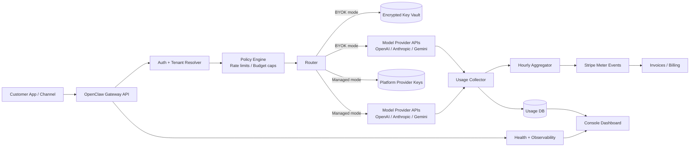

# Architecture — Hosted OpenClaw (BYOK + Managed)

## Notes
- Every request is tenant-scoped.
- Usage is recorded before billing aggregation.
- Spend caps can block managed requests in real time.
- BYOK keys are encrypted and redacted from logs.
